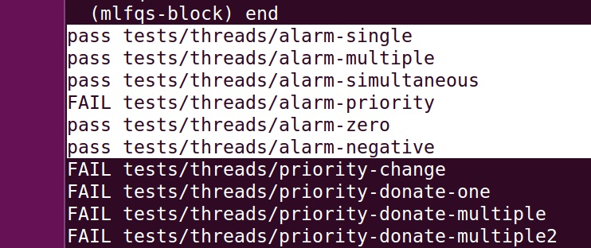

##CS302 OS Project1

> 11510064 王林


### Task 1: Efficient Alarm Clock

---- ORIGINAL ----

> For the original method, when a thread invoke the `timer_sleep () ` function, it just put the thread into the **Ready Queue** according to `thread_yield ()`  for the specified `ticks` time. However, the thread which should be blocked only just be put into hte **Ready Queue**, then operation system (scheduler) will take the next thread from **Ready Queue** into **Running Queue**. However, the next thread is the one which was put into here just now. So actually, the CPU is occupied by the same thread, which is the idea of [busy waiting](https://en.wikipedia.org/wiki/Busy_waiting).

So the real block should be applied in the thread when it invoke `timer_sleep ()`.

##### Procedure

In a call to `time_sleep()`

1. `if` branch to specify the ticks for block should larger than zero.(Useful for `alarm-zero` test).
2. Disable interrupts.
3. Store info of current thread.
4. Set the ticks the current thread wait for.
5. `thread_block()` to make current thread sleep.
6. Recover interrupts.

However, it need considered that something count the ticks it have sleep, clock interrupt handler will be used. So in the function `timer_interrupt()`, we use `thread_foreach()` to detect the blocked thread's sleep ticks, if its sleep ticks have been used up, the blocked thread need to be waked up.

```c
/* Detect the blocked thread */
void
detect_blocked_thread (struct thread *t, void *aux UNUSED)
{
  if (t->status == THREAD_BLOCKED && t->sleep_ticks > 0)
  {
    t->sleep_ticks--;
    if (t->sleep_ticks == 0)
    {
      thread_unblock(t);
    }
  }
}
```

Put the function `detect_blocked_thread()` in the `timer_interrupt()` of <u>timer.c</u> file. That could execute the `detect_blocked_thread()` every clock interrupt. 

##### Result



### Task 2: Priority Scheduler

> Still on the process of finishing


### Task 3: Multi-level Feedback Queue Scheduler (MLFQS)

>  Still on the process of finishing

